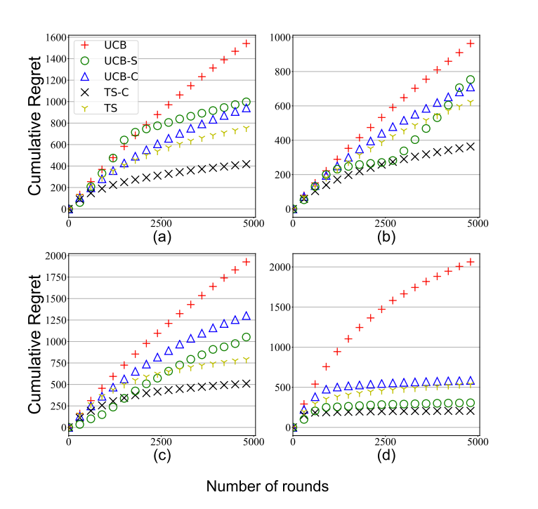

# [A Unified Approach to Translate Classical Bandit Algorithms to the Structured Bandit Setting](https://arxiv.org/pdf/1810.08164.pdf)

<!-- Note that most of the old code was written in Python 2 to kindly feel free to point out any incompatibility to me/raise a PR. -->

**Abstract:** We consider a finite-armed structured bandit problem in which mean rewards of different arms are known functions of a common hidden parameter θ\*. Since we do not place any restrictions on these functions, the problem setting subsumes several previously studied frameworks that assume linear or invertible reward functions. We propose a novel approach
to gradually estimate the hidden θ\* and use the estimate together with the mean reward functions to substantially reduce exploration of sub-optimal arms. This approach enables us to fundamentally generalize any classical bandit algorithm including UCB and Thompson Sampling to the structured bandit setting. We prove via regret analysis that our proposed UCB-C algorithm (structured bandit versions of UCB) pulls only a subset of the sub-optimal
arms O(log T) times while the other sub-optimal arms (referred to as non-competitive arms) are pulled O(1) times. As a result, in cases where all sub-optimal arms are non-competitive, which can happen in many practical scenarios, the proposed algorithm achieves bounded regret. We also conduct simulations on the Movielens recommendations dataset to demonstrate the improvement of the proposed algorithms over existing structured bandit
algorithms.

## Requirements
All required modules are listed in <tt>requirements.txt</tt> and can be installed by:
````
pip3 install -U -r requirements.txt
````
### 1. Download the datasets
The datasets can be downloaded as follows:
````
cd data
source download_data.sh
````
This will download the [MovieLens 1M Dataset](https://grouplens.org/datasets/movielens/1m/). You may edit <tt> download_data.sh</tt> to download different datasets and add necessary preprocessing functions to <tt>preproc/preproc.py</tt>.

### 2. Run preprocessing

Pre-processing as described in the paper can be done with <tt>preproc/preproc.py</tt>. As an example:
```
python preproc.py --movielens --train_test_ratio=0.5
```
will process the MovieLens Dataset with a train-test split of 50:50. For a different dataset, any preprocessing steps may be included in this file.

### 3. Bandit algorithms

Bandit algorithms - UCB, TS, UCB-C, TS-C, UCB-S - can be run from <tt>algos.py</tt>. The description of the arguments is:
```
num_iterations  :   Number of iterations of each run
T               :   Number of rounds (horizon)
```
Example:<br>
`python3 c_algos.py --num_iterations 20 --T 5000 `

The script saves plots of the generated results in a folder <tt>data/plot_arrays</tt>.

## Results
Below are some results for the MovieLens dataset. For details about the experiments, kindly refer to Section 7 of the [paper](https://arxiv.org/pdf/1810.08164.pdf).

#### Comparison of algorithms on Movielens
<p align=center>

</p>
